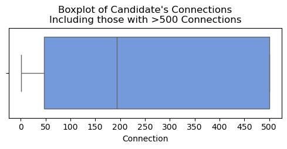
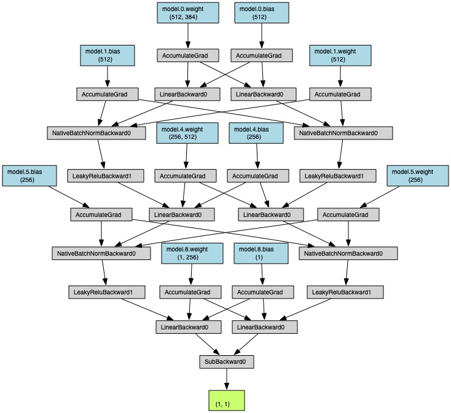

# Potential Talents - An Apziva Project (#3)
By Samuel Alter  
Apziva: 6bImatZVlK6DnbEo

## Summary

Using NLP techniques to analyze a job candidate dataset. This project is split into two parts:
* [**Part 1**](#eda): More straightforward NLP analysis to ultimately rank the candidates base on their job title's similarity to the search terms
* [**Part 2**](#p2): Implementing machine learning models for [Learning to Rank](https://towardsdatascience.com/learning-to-rank-a-complete-guide-to-ranking-using-machine-learning-4c9688d370d4) scoring systems.

## Overview

We are working with a talent sourcing and management company to help them surface candidates that are a best fit for their human resources job post. We are using a dataset of job candidates' job titles, their location, and their number of LinkedIn connections.

### Goals

Produce a probability, between 0 and 1, of how closely the candidate fits the job description of **"Aspiring human resources"** or **"Seeking human resources."** After an initial recommendation pulls out a candidate(s) to be starred for future consideration, the recommendation will be re-run and new "stars" will be awarded.

To help predict how the candidates fit, we are tracking the performance of two success metrics:
* Rank candidates based on a fitness score
* Re-rank candidates when a candidate is starred

We also need to do the following:
* Explain how the algorithm works and how the ranking improves after each starring iteration
* How to filter out candidates which should not be considered at all
* Determine a cut-off point (if possible) that would work for other roles without losing high-potential candidates
* Ideas to explore on automating this procedure to reduce or eliminate human bias

### The Dataset

| Column | Data Type | Comments |
|---|---|---|
| `id` | Numeric | Unique identifier for the candidate |
| `job_title` | Text | Job title for the candidate |
| `location` | Text | Geographic location of the candidate |
| `connections` | Text | Number of LinkedIn connections for the candidate |

Connections over 500 are encoded as "500+". Some do not have specific locations listed and just had their country, so I substituted capitol cities or geographic centers to represent those countries.

## Part 1: EDA and Candidate Ranking from Text Embedding 

There are no nulls in the dataset. There are 104 total observations.

### Connections

Most applicants have more than 500 connections (n=44). But if we look at [Figure 1](#fig1) to see those that have less than 500 connections, the majority of this group have around 50:

[Figure 1](#fig1): Histogram of Connections

Viewing the data as a boxplot in Figures [2](#fig2) and [3](#fig3) shows this patten well:

[Figure 2](#fig2): Boxplot of all candidate's connections

[Figure 3](#fig3): Boxplot of candidates who have fewer than 500 connections

### Geographic Locations

There is some location data and it would be good to see where the candidates are located in the world. [Figure 4](#fig4) shows a choropleth of the candidates' locations.

[Figure 4](#fig4): Choropleth of candidates' locations. 
Three US-based candidates did not provide a city so they are not included in this map.

### Initial NLP 

I defined a preprocessor that didn't include lemmatization so as to preserve the specific words included in the job titles. After running the preprocessor over the job titles, I plotted the [10 most-common words](#fig5) in the corpus:

[Figure 5](#fig5): Top 10 most-common words in the candidates' job titles

It's fun to make a [wordcloud](#fig6) which shows all the words in the corpus, sized by their prevalence. We can see that "human","resources", and "aspiring" all appear frequently in the dataset.

[Figure 6](#fig6): Wordcloud of most common words in the candidates' job titles

#### Text Embedding and Cosine Similarity

As a reminder, we are currently helping the company understand which candidates are a best fit for their human resources position. As such, the company is focusing on two search terms:  
* **"Aspiring human resources"**, or
* **"Seeking human resources"**

We will use the same preprocessor as above, without lemmatization, and will use the **cosine similarity** to determine the similarity between the job titles and the search terms.

We used five methods for text embedding:  
* **`Tfidf`**
* **`Word2Vec`**
* **`GloVe`**
* **`fastText`**, and
* **`SBERT`**

##### Notes on methods

The steps for these methods are similar:  
1. Load word embeddings
1. Process job titles and search terms
1. Calculate cosine similarity

* **`GloVe`**
> The [`GloVe`](https://nlp.stanford.edu/projects/glove/) model (Global Vectors for Word Representation) is a word embedding model that provides a dense vector representation of words similar to `Word2Vec`. `GloVe` was trained on matrix factorization techniques.
> We used the 6B model, which can be downloaded from [here](https://nlp.stanford.edu/data/glove.6B.zip).

* **`fastText`**
> [`fastText`](https://fasttext.cc) is another word embedding model with the advantage that it can handle out-of-vocabulary (OOV) words using subword embeddings. Said another way, it can generate embeddings for words that are not in the training vocabulary, which can be helpful for uncommon words or typos.
> We'll be using the [Wiki News 300d](https://dl.fbaipublicfiles.com/fasttext/vectors-english/wiki-news-300d-1M-subword.vec.zip) vector with subwords, measuring at 16 billion tokens. This was trained on Wikipedia in 2017.

* **`SBERT`**
> Sentence-BERT, or [SBERT](https://www.sbert.net), is designed to generate sentence embeddings rather than individual word embeddings like the previous four methods we've employed.

With five methods, I wanted to plot the similarity scores over time. Comparing how to each method changes the position of the candidates sequentially was interesting, as the methods gave different candidates to have the highest similarity score. You can view the comparison chart below:

[Figure 7](#fig7): Comparing the cosine similarity scores based on methods of text embedding of the candidates' job title to the search terms

What about comparing the candidates overall, across all the methods? I decided to come up with the following scoring system:  
* If you are in first place for a particular method, you get no penalty
* Second place gets one point, third place gets two points, etc.
* Any candidate equal to or beyond 10th place gets 10 penalty points
* Save the points for each candidate and for each method
* Take the mean of the points across all the methods
* Then [plot the scores](#fig8) using this penalty or "golf"-style scoring method

[Figure 8](#fig8): Best scoring candidates overall

Using this compound score, I applied a rank to the candidates. Looking at the ranks, I saw that the models were not perfect, as some candidates with job titles that match reasonably well the sentiment if not the letter of the search terms are getting ranked a lot lower than others.

RankNet, the first neural network that we will use in the [next section](#p2), requires that the job titles be vectorized. I will use the final method, [SBERT](#sbert), as that is a robust method of word embedding. Thankfully, we can use the dataframe that we computed in the SBERT section.

I will also manually adjust some rankings and save those to a new column.

The final step before **Part 2** is to prepare the data for the neural network training. This involves three steps:
1. **Generate pairs** to rank the candidates
2. Use `train_test_split` to partition the dataset into training and testing splits
3. Save the splits to **parquet**

## Part 2 - Machine learning models using Learning to Rank systems 

`RankNet`, a pairwise ranking algorithm, is defined by its specific ranking methodology rather than the specifics of its architecture. It is defined by:
* **Pairwise comparison** of pairs of inputs
* **Sigmoid-based** probability output
* **Loss function** involving **Binary Cross-Entropy Loss** to compute error between predicted probabilities and true pairwise labels
* **Backpropagation and gradient decent** allows for training and updating weights using gradients calculated from the pairwise ranking loss

I was curious if there was something inherent in the architecture of the neural network that made the algorithm RankNet. I learned that the architecture in fact is not fixed and we can:
* Add or remove layers
* Change the number of neurons in the hidden layers
* Adjust activation functions
* Change dropout rates

See below for an image of the architecture of the network. I opted for a sequential stack of layers involving the following:
1. **Fully-connected** layer with 512 inputs and 512 outputs, which projects the input features into a higher-dimensional space
2. **Batch normalization** transforms the activatiosn to have zero mean and unit variance within each batch
3. **Dropout** layer to randomly set 50% of the activations to zero during training, which prevents overfitting by introducing randomness in training
4. **LeakyReLU Activation** introduces non-linearity and helps improve the model's learning capability
5. **Fully-connected** layer with 512 inputs, outputting 256 to compress the feature space to focus on the most important representations
6. **Normalization and Dropout** layers to stabilize training and reduce overfitting
7. **LeadyReLU Activation** to reintroduce non-linearity
8. **Fully-connected** output layer with 256 inputs and 1 output

I also defined a forward pass for the network, which takes two inputs and computes the difference in their scores. This is a key step as it helps to define the algorithm as RankNet.

Finally, I defined training and testing functions:
**Training function**
> Uses batching, a binary cross-entropy loss calculation with logits, an optimizer for the backward pass, a sigmoid conversion to turn logits to probabilities, thresholds probabilities to 0.5 for binary classification, and outputs the loss and accuracy for each epoch
**Testing function**
> Uses a similar proceses involving batching, loss calculation, conversion of logits to probabilities, computing the average test loss and accuracy, and finally compiles the probability results into a dataframe

Under construction...
