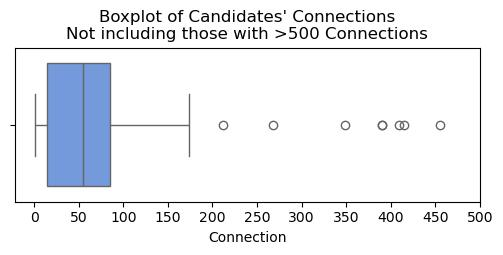
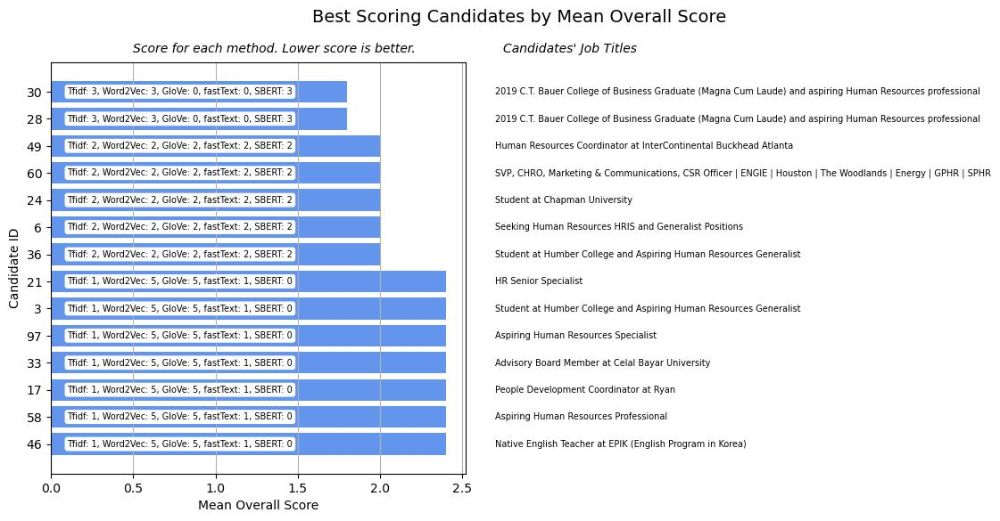

# Potential Talents - An Apziva Project (#3)
By Samuel Alter  
Apziva: 6bImatZVlK6DnbEo

## Summary

Using NLP techniques to analyze a job candidate dataset

## Overview

We are working with a talent sourcing and management company to help them surface candidates that are a best fit for their human resources job post. We are using a dataset of job candidates' job titles, their location, and their number of LinkedIn connections.

### Goals

Produce a probability, between 0 and 1, of how closely the candidate fits the job description of **"Aspiring human resources"** or **"Seeking human resources."** After an initial recommendation pulls out a candidate(s) to be starred for future consideration, the recommendation will be re-run and new "stars" will be awarded.

To help predict how the candidates fit, we are tracking the performance of two success metrics:
* Rank candidates based on a fitness score
* Re-rank candidates when a candidate is starred

We also need to do the following:
* Explain how the algorithm works and how the ranking improves after each starring iteration
* How to filter out candidates which should not be considered at all
* Determine a cut-off point (if possible) that would work for other roles without losing high-potential candidates
* Ideas to explore on automating this procedure to reduce or eliminate human bias

### The Dataset

| Column | Data Type | Comments |
|---|---|---|
| `id` | Numeric | Unique identifier for the candidate |
| `job_title` | Text | Job title for the candidate |
| `location` | Text | Geographic location of the candidate |
| `connections` | Text | Number of LinkedIn connections for the candidate |

Connections over 500 are encoded as "500+". Some do not have specific locations listed and just had their country, so I substituted capitol cities or geographic centers to represent those countries.

## EDA 

There are no nulls in the dataset. There are 104 total observations.

### Connections

Most applicants have more than 500 connections (n=44). But if we look at [Figure 1](#fig1) to see those that have less than 500 connections, the majority of this group have around 50:

[Figure 1: Histogram of Connections](#fig1)

Viewing the data as a boxplot in Figures [2](#fig2) and [3](#fig3) shows this patten well:

[Figure 2](#fig2): Boxplot of all candidate's connections

[Figure 3](#fig3): Boxplot of candidates who have fewer than 500 connections

### Geographic Locations

There is some location data and it would be good to see where the candidates are located in the world. [Figure 4](#fig4) shows a choropleth of the candidates' locations.

[Figure 4](#fig4): Choropleth of candidates' locations. Three candidates did not provide a city so they are not included in this map.

### Initial NLP 

I defined a preprocessor that didn't include lemmatization so as to preserve the specific words included in the job titles. After running the preprocessor over the job titles, I plotted the [10 most-common words](#fig5) in the corpus:

[Figure 5](#fig5): Top 10 most-common words in the candidates' job titles

Under construction...
