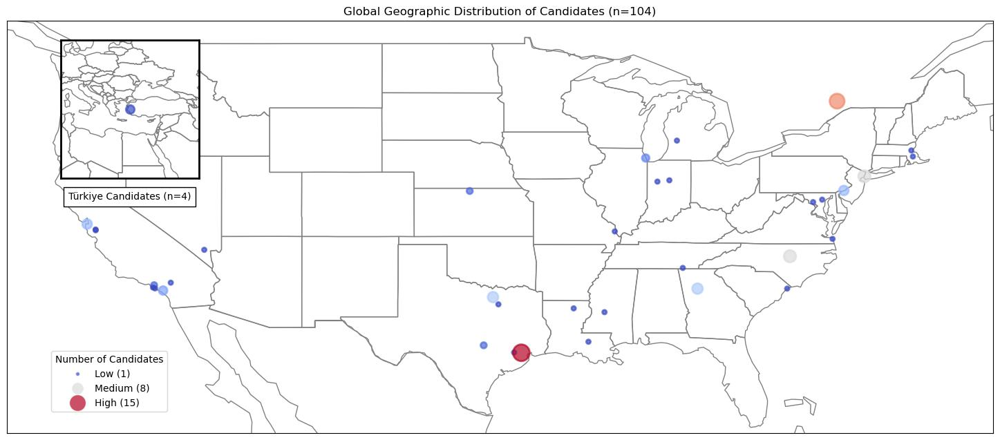

# Potential Talents - An Apziva Project (#3)
By Samuel Alter  
Apziva: 6bImatZVlK6DnbEo

## Summary
Using NLP techniques to analyze a job candidate dataset

### Overview

Under construction...

| Candidate ID | Job Title | Location | Average Similarity Score |
|---|---|---|---|
| 73 | 2019 C.T. Bauer College of Business Graduate (Magna Cum Laude) and aspiring Human Resources professional | Houston, TX | 0.598691 |
| 46 | Aspiring Human Resources Professional | Raleigh, NC | 0.539892 |
| 58 | Aspiring Human Resources Professional | Raleigh, NC |  |
| 17 | Aspiring Human Resources Professional | Raleigh, NC |  |
| 33 | Aspiring Human Resources Professional | Raleigh, NC |  |
| 97 | Aspiring Human Resources Professional | Kokomo, IN  |
| 3 | Aspiring Human Resources Professional | Raleigh, NC |  |
| 21 | Aspiring Human Resources Professional | Raleigh, NC |  |
| 36 | Aspiring Human Resources Specialist | New York, NY | 0.498402 |
| 6 | Aspiring Human Resources Specialist | New York, NY |  |
